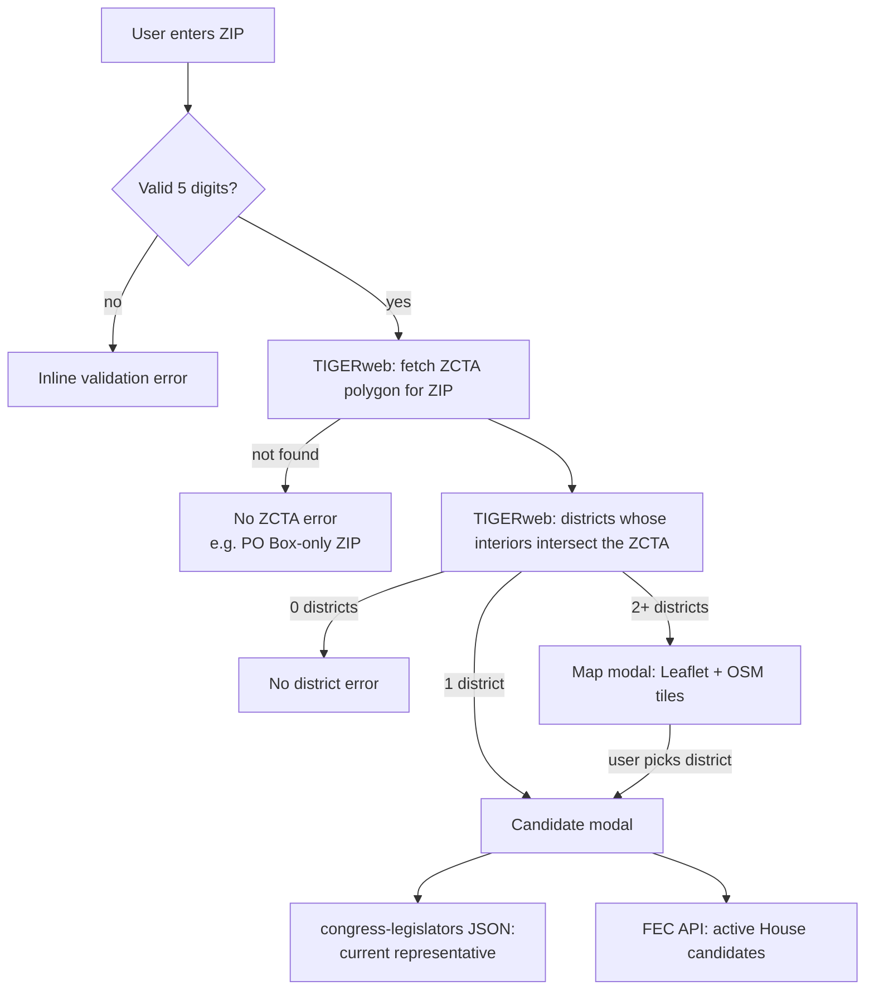

# ZIP to Congressional District Lookup

A static, client-side web app that maps a 5-digit ZIP code to its U.S. House district(s), then shows the sitting representative and the candidates who have filed with the Federal Election Commission (FEC) for the upcoming election.

There is no backend, no build step, and no package manager. The site is four files served as-is, plus a local `config.js` that holds the FEC API key.

---

## Table of contents

1. [Architecture](#architecture)
2. [Data sources](#data-sources)
3. [Privacy and data flows](#privacy-and-data-flows)
4. [FEC API key setup](#fec-api-key-setup)
5. [Running locally](#running-locally)
6. [Deploying](#deploying)
7. [Maintenance notes](#maintenance-notes)
8. [Troubleshooting](#troubleshooting)

---

## Architecture

### Files

| File | Purpose |
| --- | --- |
| `index.html` | Page markup: the ZIP form, the multi-district map modal, and the candidate modal. Loads Leaflet from unpkg, then `config.js`, then `app.js`. |
| `app.js` | All application logic, wrapped in a single IIFE. |
| `styles.css` | All styling. |
| `config.js` | **Not in git.** Sets `window.FEC_API_KEY`. See [FEC API key setup](#fec-api-key-setup). |
| `.gitignore` | Excludes `config.js`. |

Script load order matters: `config.js` must load before `app.js`, because `app.js` reads `window.FEC_API_KEY` once at startup.

### Request flow



### Key implementation details (`app.js`)

- **ZIP to district resolution.** A ZIP is resolved through its Census ZIP Code Tabulation Area (ZCTA). The ZCTA polygon is sent back to TIGERweb as an Esri polygon, and the query uses the DE-9IM relation `T********` ("interiors intersect"). That way districts that only share a border with the ZIP are excluded.
- **District vintage.** `CD_QUERY_URL` uses TIGERweb Legislative layer `0` (120th Congress, the 2026 election districts). Layer `4` is the 119th Congress.
- **Election year.** `ELECTION_YEAR` is the current year rounded up to the next even year.
- **District IDs.** Districts are keyed as `STATE-NN`, for example `NY-10`. At-large seats (`00`) and non-voting delegates (`98`) become `STATE-AL`, and both map to district number `0` for the FEC and congress-legislators lookups. GEOIDs ending in `ZZ` (water or unassigned areas) are dropped.
- **Concurrency.** Each lookup and each candidate modal has a sequence number and an `AbortController`. A newer request cancels the older one, and stale responses are discarded. Every request times out after `REQUEST_TIMEOUT_MS` (20 s).
- **Caching (in memory, per page load only).**
  - The congress-legislators file (about 1.5 MB) is fetched once at startup and shared.
  - FEC results are cached per district ID in `fecCandidatesByDistrict`.
- **Independent failure.** The representative section and the candidate section render separately, so if one source fails the other still shows.
- **Accessibility.** Both modals trap focus, close on `Escape` or a backdrop click, and return focus to whatever element opened them.

---

## Data sources

| Source | Endpoint | Used for | Auth |
| --- | --- | --- | --- |
| U.S. Census TIGERweb | `tigerweb.geo.census.gov/arcgis/rest/services/TIGERweb/...` | ZCTA and congressional district geometry | None |
| congress-legislators | `unitedstates.github.io/congress-legislators/legislators-current.json` | Current House representative | None |
| OpenFEC | `api.open.fec.gov/v1/candidates/` | Active candidates for the election year | **API key** |
| OpenStreetMap | `tile.openstreetmap.org` | Map tiles in the multi-district modal | None |
| unpkg | `unpkg.com/leaflet@1.9.4` | Leaflet JS/CSS (pinned with SRI hashes) | None |

---

## Privacy and data flows

The app has no server, no analytics, no cookies, and no `localStorage` or `sessionStorage`. Nothing the user enters is stored or sent to anything the organization runs. Everything happens in the user's browser, but these third-party services do receive data directly from it:

| Recipient | What it receives |
| --- | --- |
| Census TIGERweb | The ZIP code entered, plus the ZCTA polygon for that ZIP. |
| OpenFEC (api.data.gov) | State, district number, election year, and **our API key**. The ZIP itself is not sent. |
| OpenStreetMap tile servers | Tile coordinates for the area around the ZIP. Only happens when the ZIP spans more than one district. |
| GitHub Pages (congress-legislators) | A single static file request. No user input is sent. |
| unpkg | A static asset request. No user input is sent. |

All of these recipients also see the user's IP address and browser headers, as with any web request. If the deployment has a privacy policy, it should name these services.

### The FEC key is public once deployed

Because the app runs entirely in the browser, **anyone visiting the deployed site can read the FEC API key**. It appears in `config.js` and in the `api_key=` query parameter of every FEC request in the browser's network tab. Keeping `config.js` out of git only protects the key from the repository, not from site visitors.

The risk is limited: the key only grants read access to public FEC data. The realistic abuse is someone copying the key and using up its rate limit. Handle it like this:

- **Use a dedicated key for each deployment** (production, staging, and each developer locally). Never reuse a personal key or a key tied to other services.
- **Register production keys to an organizational email address**, not a personal one.
- **Rotate the key** if the site starts hitting rate limits unexpectedly.
- **If the key must stay secret**, put a small server-side proxy (for example a Cloudflare Worker, Netlify Function, or similar) in front of `api.open.fec.gov`. The proxy adds the key on the server and forwards the request, and `FEC_CANDIDATES_URL` in `app.js` points at the proxy instead. The current code does not include a proxy.

---

## FEC API key setup

### 1. Get a key

1. Sign up at <https://api.data.gov/signup/>. The key is free and arrives by email right away.
2. The same key works for every api.data.gov service, including OpenFEC.
3. The default limit is **1,000 requests per hour per key**. The app makes at most one FEC request per district per page load, because results are cached.

### 2. Create `config.js`

In the project root, create `config.js`:

```js
// Free key from https://api.data.gov/signup/ — leave empty to fall back to the rate-limited DEMO_KEY.
window.FEC_API_KEY = 'YOUR_API_DATA_GOV_KEY';
```

`config.js` is listed in `.gitignore`. **Do not commit it**, and do not paste the key into `app.js`, `index.html`, issues, pull requests, or chat.

Before committing, check that git is still ignoring it:

```sh
git check-ignore -v config.js   # should print: .gitignore:1:config.js  config.js
git status --short              # config.js should NOT appear
```

### 3. Fallback behavior

If `config.js` is missing, or `window.FEC_API_KEY` is empty, `app.js` uses the public `DEMO_KEY`. The app still works, but `DEMO_KEY` has a very low shared rate limit. When the limit is hit, the candidate section shows:

> FEC rate limit reached. Set window.FEC_API_KEY in config.js to a free api.data.gov key.

The representative section and the map keep working, because they don't depend on the FEC.

### 4. If a key is leaked into git

If a key is ever committed, rewriting history is not enough, because the key may already be cloned or cached. Instead:

1. Request a new key at <https://api.data.gov/signup/>.
2. Put the new key in `config.js` on every environment that uses it.
3. Stop using the old key. To have it deactivated, contact api.data.gov support.

---

## Running locally

**Requirements:** a modern browser and any static file server. There are no dependencies to install.

```sh
git clone https://github.com/dmilstone/zip_cd.git
cd zip_cd

# Create config.js as described above, then:
python3 -m http.server 8000
```

Open <http://localhost:8000>.

Serve the files over HTTP instead of opening `index.html` from disk (`file://`). Browsers treat `file://` pages as having a `null` origin, which can break cross-origin requests.

### Smoke test

The hint row under the input has sample ZIPs to try:

| ZIP | Expected result |
| --- | --- |
| `20001` | Single district (DC at-large delegate). The candidate modal opens directly. |
| `05401` | Single district (Vermont at-large). |
| `82001` | Single district (Wyoming at-large). |
| `11201` | Spans two districts. The map modal opens, and picking a district opens its candidates. |

Also confirm that the "2026 candidates" section loads without a rate-limit message. That shows your key is being picked up.

---

## Deploying

Any static host works, such as GitHub Pages, Netlify, Cloudflare Pages, S3 + CloudFront, or an internal web server. The deploy steps are the same everywhere:

1. **Publish** `index.html`, `app.js`, and `styles.css`.
2. **Provide `config.js` separately**, since it isn't in the repository. Either:
   - upload it by hand or through a secured deploy step, or
   - generate it at deploy time from a CI secret, for example:

     ```sh
     printf "window.FEC_API_KEY = '%s';\n" "$FEC_API_KEY" > config.js
     ```

     Store `FEC_API_KEY` as an encrypted secret in the CI provider (such as GitHub Actions secrets or Netlify environment variables). Never hard-code it in the workflow file.
3. **Verify** the deployment by running the [smoke test](#smoke-test) against the live URL.

> **GitHub Pages note:** Publishing straight from the repository branch won't include `config.js`, so the live site falls back to `DEMO_KEY`. Use a GitHub Actions workflow that writes `config.js` from a secret before uploading the Pages artifact.

### Deployment checklist

- [ ] The production key is dedicated to this site and registered to an organizational email.
- [ ] `config.js` is generated from a secret and doesn't appear in any commit, workflow log, or build artifact that's publicly stored.
- [ ] The site is served over HTTPS.
- [ ] The smoke-test ZIPs return candidates with no rate-limit message.
- [ ] The privacy policy (if there is one) lists the third-party services in [Privacy and data flows](#privacy-and-data-flows).

---

## Maintenance notes

- **After redistricting or a new Congress,** check that TIGERweb Legislative layer `0` in `CD_QUERY_URL` is still the district set you want, and update the comment next to it.
- **Leaflet upgrades:** update both the URLs and the `integrity` SRI hashes in `index.html`.
- **FEC party names** vary in format. `PARTY_CLASSES` matches loosely on `dem` and `rep` prefixes, and everything else gets the neutral style.
- **ZCTAs aren't ZIP codes.** ZCTAs approximate USPS delivery areas, so PO Box-only and single-business ZIPs have no ZCTA and return a "not found" error. This is expected.

---

## Troubleshooting

| Symptom | Likely cause | Fix |
| --- | --- | --- |
| "FEC rate limit reached…" | `config.js` is missing or empty (so `DEMO_KEY` is used), or the key's hourly limit is used up. | Check that `config.js` is deployed and loads before `app.js`. Check the network tab for `api_key=`. Rotate the key if it's being abused. |
| "Couldn't load candidates from the FEC API" | Invalid or deactivated key, or an FEC outage. | Test with `curl "https://api.open.fec.gov/v1/candidates/?api_key=YOUR_KEY&per_page=1"`. |
| "Couldn't reach the Census TIGERweb service" | TIGERweb outage or timeout. | Retry later. TIGERweb is occasionally slow. |
| "No Census ZIP Code Tabulation Area found" | The ZIP has no ZCTA (PO Box or single business). | Expected behavior. |
| Map area shows "Map failed to load" | unpkg or Leaflet is blocked, or the SRI hash doesn't match. | Check the network tab and the `integrity` attributes. The district list still works. |
| Current representative doesn't load | The congress-legislators file failed to download. | It retries on the next district selection. |
