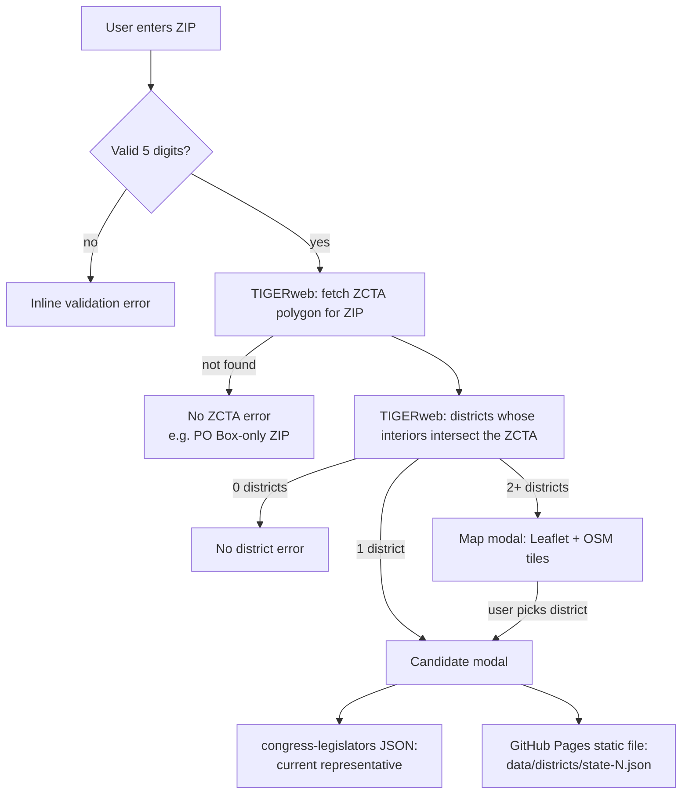

# ZIP to Congressional District Lookup

A static, client-side web app that maps a 5-digit ZIP code to its U.S. House district(s), then shows the sitting representative and the candidates who have filed with the Federal Election Commission (FEC) for the 2026 election.

There is no backend, no build step, and no package manager. Candidate data for all 50 states, all 435 voting House districts, and the Washington, D.C. delegate seat is pre-fetched from the FEC by a scheduled GitHub Actions job, committed to the repository as static JSON, and served from GitHub Pages at `https://dmilstone.github.io/zip_cd/data/districts/`. The browser never talks to the FEC and needs no API key.

---

## Table of contents

1. [Coverage](#coverage)
2. [Architecture](#architecture)
3. [Daily FEC sync](#daily-fec-sync)
4. [Data sources](#data-sources)
5. [Privacy and data flows](#privacy-and-data-flows)
6. [Running locally](#running-locally)
7. [Deploying](#deploying)
8. [Maintenance notes](#maintenance-notes)
9. [Troubleshooting](#troubleshooting)

---

## Coverage

- **All 50 states, all 435 voting districts, plus DC (436 files).** `data/districts/` holds one file per district, named `<state>-<district>.json` (for example `ca-12.json`). The six at-large states (AK, DE, ND, SD, VT, WY) and DC use district `0`, for example `wy-0.json` and `dc-0.json`.
- **Works on any site.** `app.js` loads candidate files from the absolute GitHub Pages URL (`DISTRICT_DATA_BASE_URL`), which GitHub serves with `Access-Control-Allow-Origin: *`. A page that embeds the widget doesn't need its own `data/` folder. There is no API key to configure.
- **Not covered: territorial delegates.** Puerto Rico, Guam, the U.S. Virgin Islands, American Samoa, and the Northern Mariana Islands are not in the sync list. ZIPs in those areas still resolve to a district and show the current delegate, but the candidate section reports that data hasn't been published.

---

## Architecture

### Files

| File | Purpose |
| --- | --- |
| `index.html` | Page markup: the ZIP form, the multi-district map modal, and the candidate modal. Loads Leaflet from unpkg, then `app.js`. |
| `app.js` | All browser logic, wrapped in a single IIFE. |
| `styles.css` | All styling. |
| `data/districts/*.json` | One raw FEC `/v1/candidates/` response per district. Written by `update_candidates.js`. |
| `update_candidates.js` | Node script that fetches candidate data from the FEC. Runs in GitHub Actions, never in the browser. |
| `.github/workflows/sync_candidates.yml` | Scheduled workflow that runs the sync script and pushes the results to `main`. |

### Request flow



### Key implementation details (`app.js`)

- **ZIP to district resolution.** A ZIP is resolved through its Census ZIP Code Tabulation Area (ZCTA). The ZCTA polygon is sent back to TIGERweb as an Esri polygon, and the query uses the DE-9IM relation `T********` ("interiors intersect"). That way districts that only share a border with the ZIP are excluded.
- **District vintage.** `CD_QUERY_URL` uses TIGERweb Legislative layer `0` (120th Congress, the 2026 election districts). Layer `4` is the 119th Congress.
- **District IDs.** Districts are keyed as `STATE-NN`, for example `NY-10`. At-large seats (`00`) and non-voting delegates (`98`) become `STATE-AL`, and both map to district number `0` for the candidate file and congress-legislators lookups. GEOIDs ending in `ZZ` (water or unassigned areas) are dropped.
- **Candidate data.** `fetchFecCandidates` requests `<DISTRICT_DATA_BASE_URL><state>-<district>.json` (`https://dmilstone.github.io/zip_cd/data/districts/`). Change that constant if you publish the data somewhere else. A `404` shows "Candidate data for XX-N hasn't been published yet."
- **Concurrency.** Each lookup and each candidate modal has a sequence number and an `AbortController`. A newer request cancels the older one, and stale responses are discarded. Every request times out after `REQUEST_TIMEOUT_MS` (20 s).
- **Caching (in memory, per page load only).** The congress-legislators file (about 1.5 MB) is fetched once and shared. Candidate lists are cached per district ID in `fecCandidatesByDistrict`.
- **Independent failure.** The representative section and the candidate section render separately, so if one source fails the other still shows.
- **Accessibility.** Both modals trap focus, close on `Escape` or a backdrop click, and return focus to whatever element opened them.

---

## Daily FEC sync

`.github/workflows/sync_candidates.yml` runs `update_candidates.js` on a cron schedule of `0 0 * * *` (every day at 00:00 UTC). It can also be started by hand from the Actions tab (`workflow_dispatch`).

Each run:

1. Checks out `main` and sets up the current Node.js LTS.
2. Runs `node update_candidates.js --force` with `FEC_API_KEY` taken from the repository secret of the same name.
3. Stages `data/districts/`. If nothing changed, the job exits. Otherwise it commits as `github-actions[bot]` with the message `Sync FEC candidate data (YYYY-MM-DD)` and pushes straight to `main`.

No one has to approve or merge anything. If the site is published from `main`, it picks up the new data on the next Pages build.

### What the script does

- Creates `data/districts/` if it doesn't exist.
- Walks every state and district in `STATES_AND_DISTRICTS` (50 states plus DC, 436 districts) and calls `https://api.open.fec.gov/v1/candidates/` with `office=H`, `election_year=2026`, the state, and the zero-padded district.
- Writes the raw FEC response, unchanged, to `data/districts/<state>-<district>.json`.
- Waits 500 ms between requests (`REQUEST_DELAY_MS`) to stay under the production key's limit of 120 requests per minute. A full run of all 436 districts takes about 4 to 6 minutes, depending on FEC response times.
- On HTTP `429`, it reads `X-RateLimit-Reset` or `Retry-After`, sleeps, and retries up to 3 times.
- If a district fails, the existing file for that district is left alone, the remaining districts still run, and the job exits non-zero so the failure shows up in Actions.
- Ends with a summary: district count, how many were fetched, skipped, and failed, the total number of candidates, and the elapsed time.

### Refresh behavior

With `--force` (what the workflow uses), every district is re-fetched on every run, and only files whose contents changed are committed. Without `--force`, the script **skips any district that already has a valid file** (JSON with a `results` array) and only fills in missing or corrupt ones.

### Scheduling caveats

- GitHub runs scheduled workflows on a best-effort basis. Runs at 00:00 UTC are often delayed by several minutes to an hour when Actions is busy, and occasionally skipped.
- In public repositories, GitHub disables scheduled workflows after 60 days with no repository activity. Re-enable the workflow from the Actions tab if that happens.
- The workflow needs `contents: write` permission, and `main` must allow `github-actions[bot]` to push. A branch protection rule that requires pull requests will block the push step.

### API key and rate limits

The sync runs on an approved high-volume OpenFEC production key, which allows **7,200 requests per hour and 120 requests per minute**. The per-minute cap is the one that matters: a full run is 436 requests, well under the hourly limit, but requests have to be spaced at least 500 ms apart to stay under 120 per minute. That puts the minimum time for a full national snapshot at about 3.6 minutes. With network latency, the nightly run usually finishes in 4 to 6 minutes.

Don't lower `REQUEST_DELAY_MS` below `500`. Faster spacing trips the per-minute limit, and each `429` makes the script sleep until the limit resets, so the run ends up slower, not faster.

A standard api.data.gov key (1,000 requests per hour) will not keep up at this pace. If the secret is ever replaced with a standard key, raise `REQUEST_DELAY_MS` to `4000`.

### Setting up the secret

1. In the GitHub repository, go to **Settings → Secrets and variables → Actions** and add a repository secret named `FEC_API_KEY` containing the production key.
2. Start the workflow by hand from the Actions tab and confirm the summary reports `Failed: 0`.

The key only exists in GitHub Actions. It is never written to the repository or served to visitors.

---

## Data sources

| Source | Endpoint | Used for | Called from |
| --- | --- | --- | --- |
| OpenFEC | `api.open.fec.gov/v1/candidates/` | House candidates for 2026 | **GitHub Actions only** (needs the API key) |
| Static district files | `dmilstone.github.io/zip_cd/data/districts/*.json` | Candidate lists shown to visitors | Browser (GitHub Pages, CORS `*`) |
| U.S. Census TIGERweb | `tigerweb.geo.census.gov/arcgis/rest/services/TIGERweb/...` | ZCTA and congressional district geometry | Browser |
| congress-legislators | `unitedstates.github.io/congress-legislators/legislators-current.json` | Current House representative | Browser |
| OpenStreetMap | `tile.openstreetmap.org` | Map tiles in the multi-district modal | Browser |
| unpkg | `unpkg.com/leaflet@1.9.4` | Leaflet JS/CSS (pinned with SRI hashes) | Browser |

---

## Privacy and data flows

**No API keys in the browser.** The FEC key lives only in GitHub Actions secrets. Nothing in the deployed site contains a key, so there is nothing for visitors to copy.

**No FEC rate limits for visitors.** Candidate data is a static file on GitHub Pages. Visitors never call the FEC, so FEC or api.data.gov rate limits can't affect them, however much traffic the site gets.

**The FEC never sees visitors.** Because the FEC isn't called from the browser, it receives no IP addresses, district lookups, or other visitor data.

The app has no server of its own, no analytics, no cookies, and no `localStorage` or `sessionStorage`. The ZIP-to-district lookup, the map, and the current-representative lookup still run live in the browser, though, so these third parties do receive requests directly from visitors:

| Recipient | What it receives |
| --- | --- |
| Census TIGERweb | The ZIP code entered, plus the ZCTA polygon for that ZIP. |
| OpenStreetMap tile servers | Tile coordinates for the area around the ZIP. Only happens when the ZIP spans more than one district. |
| GitHub Pages (congress-legislators) | A single static file request. No user input is sent. |
| GitHub Pages (`dmilstone.github.io`) | The file name of the selected district, for example `ny-10.json`. The ZIP itself is not sent. |
| unpkg | A static asset request. No user input is sent. |

All of these also see the visitor's IP address and browser headers, as with any web request. If the deployment has a privacy policy, it should name these services.

---

## Running locally

**Requirements:** a modern browser and any static file server. There is nothing to install and no key to set.

```sh
git clone https://github.com/dmilstone/zip_cd.git
cd zip_cd
python3 -m http.server 8000
```

Open <http://localhost:8000>.

Serve the files over HTTP instead of opening `index.html` from disk (`file://`). Browsers block `fetch` of local JSON files from `file://` pages, so candidate data won't load.

### Running the sync script locally

Requires Node.js 18 or later (for global `fetch`).

```sh
FEC_API_KEY=your_key node update_candidates.js          # only missing or invalid files
FEC_API_KEY=your_key node update_candidates.js --force  # re-fetch everything
```

The local page still loads candidate data from GitHub Pages, not from your local `data/` folder. To test local files, temporarily set `DISTRICT_DATA_BASE_URL` in `app.js` to `./data/districts/`.

### Smoke test

| ZIP | Expected result |
| --- | --- |
| `05401` | Single district (Vermont at-large, `vt-0.json`). The candidate modal opens directly. |
| `82001` | Single district (Wyoming at-large, `wy-0.json`). |
| `11201` | Spans two districts. The map modal opens, and picking a district opens its candidates. |
| `20001` | DC delegate (`dc-0.json`). The delegate and the DC candidates load. |

---

## Deploying

Any static host works, such as GitHub Pages, Netlify, Cloudflare Pages, S3 + CloudFront, or an internal web server.

1. **Publish** `index.html`, `app.js`, `styles.css`, and the `data/` directory. There is no config file to generate.
2. **Add the `FEC_API_KEY` secret** to the GitHub repository so the daily sync can run (see [Setting up the secret](#setting-up-the-secret)).
3. **Deploy from `main`** (or rebuild on every push to `main`) so the bot's data commits go live automatically.
4. **Verify** the deployment by running the [smoke test](#smoke-test) against the live URL.

### Deployment checklist

- [ ] All 436 files in `data/districts/` are committed and pushed, and `https://dmilstone.github.io/zip_cd/data/districts/vt-0.json` returns 200.
- [ ] The `FEC_API_KEY` secret is set, and the latest `Sync FEC candidates` run in Actions succeeded.
- [ ] `github-actions[bot]` can push to `main`.
- [ ] No local `config.js` or other file containing a key is uploaded to the host.
- [ ] The site is served over HTTPS.
- [ ] The privacy policy (if there is one) lists the third-party services in [Privacy and data flows](#privacy-and-data-flows).

---

## Maintenance notes

- **Election year.** `ELECTION_YEAR` is hard-coded to `2026` in `update_candidates.js`. The browser computes it as the current year rounded up to the next even year. Update the script, and clear `data/districts/`, before the 2028 cycle.
- **Apportionment.** `STATES_AND_DISTRICTS` reflects the post-2020 apportionment. Update it after the 2030 census or any mid-decade change in seat counts.
- **After redistricting or a new Congress,** check that TIGERweb Legislative layer `0` in `CD_QUERY_URL` is still the district set you want.
- **Leaflet upgrades:** update both the URLs and the `integrity` SRI hashes in `index.html`.
- **FEC party names** vary in format. `PARTY_CLASSES` matches loosely on `dem` and `rep` prefixes, and everything else gets the neutral style.
- **ZCTAs aren't ZIP codes.** ZCTAs approximate USPS delivery areas, so PO Box-only and single-business ZIPs have no ZCTA and return a "not found" error. This is expected.

---

## Troubleshooting

| Symptom | Likely cause | Fix |
| --- | --- | --- |
| "Candidate data for XX-N hasn't been published yet." | The district's JSON file isn't on GitHub Pages yet, or it's a territorial delegate district. | Check that `data/districts/` is pushed to `main` and Pages has rebuilt. For a missing district, run the sync workflow by hand. |
| "Couldn't load candidate data" | GitHub Pages returned an error or invalid JSON for the district file. | Open the file URL directly and check it. |
| Candidate data looks out of date | The last sync run failed or was skipped by GitHub. | Check the Actions tab and run the workflow by hand. |
| Sync workflow fails on push | Branch protection on `main`, or the workflow lacks `contents: write`. | Allow `github-actions[bot]` to push, or change the workflow to open a PR. |
| Sync workflow fails with "FEC_API_KEY is not set." | The repository secret is missing. | Add it under Settings → Secrets and variables → Actions. |
| Sync log shows "Rate limit hit, sleeping..." | `REQUEST_DELAY_MS` is below `500`, another job is using the same key, or the secret holds a standard 1,000/hour key instead of the production key. | Keep the delay at `500` or higher, stop other jobs from sharing the key, and check which key the secret holds. |
| Sync run takes much longer than 6 minutes | Repeated `429` retries, or slow FEC responses. | Look for rate-limit warnings in the log. If there are none, the FEC API is slow. Nothing needs fixing. |
| Sync fails with `FEC HTTP 403` | The key is invalid, revoked, or missing from the secret. | Check the key and update the `FEC_API_KEY` secret. |
| "Couldn't reach the Census TIGERweb service" | TIGERweb outage or timeout. | Retry later. TIGERweb is occasionally slow. |
| "No Census ZIP Code Tabulation Area found" | The ZIP has no ZCTA (PO Box or single business). | Expected behavior. |
| Map area shows "Map failed to load" | unpkg or Leaflet is blocked, or the SRI hash doesn't match. | Check the network tab and the `integrity` attributes. The district list still works. |
| Current representative doesn't load | The congress-legislators file failed to download. | It retries on the next district selection. |
